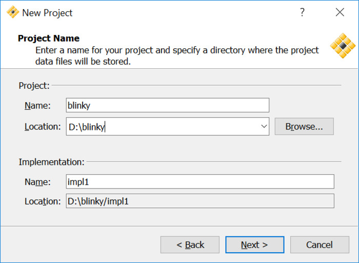
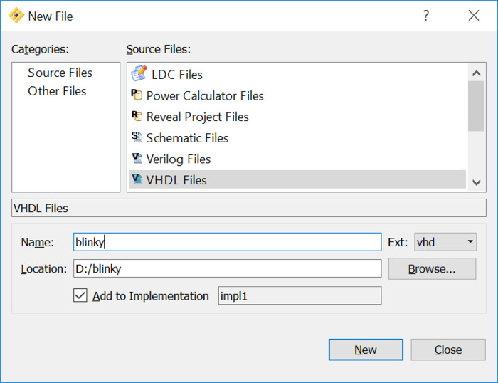
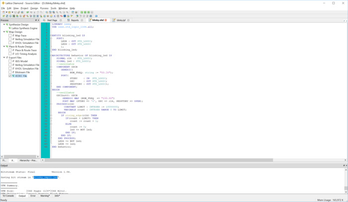

% Bugblat PIF VHDL howto

---

**TLDR:**

 * Download Lattice Diamond
 * Add
    `SYSCONFIG SDM_PORT=PROGRAMN SLAVE_SPI_PORT=ENABLE;` 
    to your .lpf file.
 * Synthesize your project
 * Flash JEDEC file using pifload.py

---

## Resources

Bugblat does not longer list the resources for the original PIF on their site. They can be found here:

 * [Manual](https://www.bugblat.com/products/pif/pif.pdf)
 * [Schematic](https://www.bugblat.com/products/pif/pif_sch.pdf)
 * [Software/Firmware Bundle](https://www.bugblat.com/products/pif/pif.zip)
 * [Github Repo](https://github.com/bugblat/pif)

## Download Lattice Diamond on your PC

* Go to the [Lattice Diamond Portal](http://www.latticesemi.com/latticediamond)
* Create an Account
* Download Lattice Diamond and install
* Start Diamond, copy your Mac to the [Licensing wizzard](http://www.latticesemi.com/en/Support/Licensing/DiamondAndiCEcube2SoftwareLicensing/DiamondFree.aspx).
* Copy the emailed license.dat to the prompted folder.

## PIF example project

Create a new project:

[](0x02/diamond_new_project.PNG)

First of all we will locate the `$ProjectName.lpf` file and add the line 

`SYSCONFIG JTAG_PORT=DISABLE SDM_PORT=PROGRAMN I2C_PORT=DISABLE SLAVE_SPI_PORT=ENABLE;`

Therefore we wont lock ourself out of I2C->SPI flashing.

Now add a VHDL file to the project:

[](0x02/diamond_new_file.PNG)

```
LIBRARY ieee;
USE ieee.std_logic_1164.all;

ENTITY blinking_led IS
   PORT(
	  LEDR : OUT STD_LOGIC;
	  LEDG : OUT STD_LOGIC
	  );
END blinking_led;

ARCHITECTURE behavior OF blinking_led IS
   SIGNAL clk  : STD_LOGIC;
   SIGNAL led : STD_LOGIC;
   --oscillator
   COMPONENT OSCH
      GENERIC(
            NOM_FREQ: string := "53.20");
      PORT( 
            STDBY    : IN  STD_LOGIC;
            OSC      : OUT STD_LOGIC;
            SEDSTDBY : OUT STD_LOGIC);
   END COMPONENT;
BEGIN
   --oscillator
   OSCInst0: OSCH
       GENERIC MAP (NOM_FREQ  => "133.00")
       PORT MAP (STDBY => '0', OSC => clk, SEDSTDBY => OPEN);
   PROCESS(clk)
		CONSTANT LIMIT : INTEGER := 10000000;
		VARIABLE count : INTEGER RANGE 0 TO LIMIT;
	BEGIN
	  IF rising_edge(clk) THEN
		 IF(count < LIMIT) THEN
			count := count + 1;
		 ELSE
			count := 0;
			led <= NOT led;
		 END IF;
	  END IF;
	END PROCESS;
	LEDG <= NOT led;
	LEDR <= led;   
END behavior;
```

Next we need to map `LEDR` and `LEDG` to the board pins. Therefore we add to our projects .lpf file:

```
LOCATE COMP "LEDR" SITE "112" ;
LOCATE COMP "LEDG" SITE "113" ;

IOBUF PORT "LEDR" IO_TYPE=LVCMOS33 PULLMODE=DOWN ;
IOBUF PORT "LEDG" IO_TYPE=LVCMOS33 PULLMODE=DOWN ;
```

On the left in the `process` tab we can now choose `JEDEC File` and use a Doubleclick on that target to synthesize.

[](0x02/diamond_syn.PNG)


Find the `.jed` file in your implementation folder and copy it over to your raspberry pi, where you can flash via:

`sudo python pif/software/pifload.py blinky_impl1.jed`

assuming your file is called `blinky_impl1.jed`.
```
====================hello==========================
Configuration file is fpga/blinky_impl1.jed
Using pif library version: 'libpif,Nov 18 2017,22:23:31'

XO2 Device ID: 012bd043  - device is an XO2-7000HC
XO2 Trace ID : 00.44.30.77_87.20.30.2B
XO2 usercode from Flash:  00.00.00.00
XO2 usercode from SRAM :  00.00.00.00
JEDEC file is fpga/blinky_impl1.jed
starting to read JEDEC file
first configuration data line: 21
. . . . . .
last configuration data line: 1586
1566 frames
finished reading JEDEC file
erasing configuration flash ...  erased
programming configuration flash ...  . . . . . . . . . . . . . . . . . . . . . . . . . . . . . . . . . . . . . . . . . . . . . . . . . . . . . . . . . . . . . . . programmed
transferring ...
configuration finished.

==================== bye ==========================
```
You should now have a led blinking pif board.

---

## Resetting the PIF in case SPI slave was disabled

If you don't sythesize with `SDM_PORT=PROGRAMN SLAVE_SPI_PORT=ENABLE` the PIF will no longer respond to your flashing attemps.

This is noticeable by the **reported IDs** beeing all **zero**.

```
$ sudo python pif/software/pifload.py pif/firmware/7000/flasher/syn/pif_flasher.jed
====================hello==========================
Configuration file is pif/firmware/7000/flasher/syn/pif_flasher.jed
Using pif library version: 'libpif,Nov 18 2017,22:23:31'

XO2 Device ID: 00000000  - unrecognised ID!
XO2 Trace ID : 00.00.00.00_00.00.00.00
XO2 usercode from Flash:  00.00.00.00
XO2 usercode from SRAM :  00.00.00.00
JEDEC file is fpga/blinky_impl1.jed
starting to read JEDEC file
JEDEC file does not match FPGA

  FPGA is XO2-256HC

  JEDEC identifies as "NOTE DEVICE NAME:        LCMXO2-7000HC-5TQFP144*"

==================== bye ==========================
```

Bugblat added a reset test pad that can be used to bring the PIF back up.

[](0x02/pif_reset.jpg)

Connect the testpad to `GND` and recover by flashing the default firmware:

`sudo python pif/software/pifload.py pif/firmware/$VERSION$/flasher/syn/pif_flasher.jed`

Replace `$VERSION$` either with `7000` or with `1200` based on your hardware.

