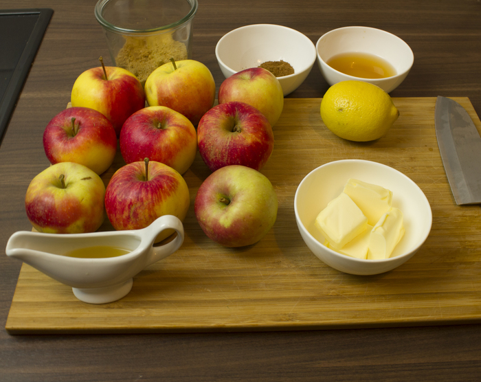

% Apfelkuchen

Die Menge ist für ein großes Blech Apfelkuchen

## Teig

### Zutaten

 * 450g Mehl
 * 80g Zucker
 * 275g weiche Butter
 * 10 Esslöffel kaltes Wasser
 * 1 Ei zum glasieren

### Zubereitung

Alle Zutaten in einer Schüssel verkneten. Bei Bedarf ein bisschen Wasser hinzugeben.
Den Teig in Frischhaltefolie einwickeln und eine Stunde Ruhen lassen. 

## Füllung

### Zutaten

 * 1500g Äpfel
 * 2 gehäufter Esslöffel brauner Zucker
 * 2 gehäufter Esslöffel weißer Zucker
 * 1 gehäufter Teelöffel Zimt
 * 100g Butter
 * 1 Shot Apfelsaft
 * 1 Shot Whiskey
 * 1 Esslöffel Honig
 * Zitronensaft nach Geschmack
 * Etwas Sonnenblumenöl

### Zubereitung
Die Äpfel schälen und würfeln. In einer großen Pfanne oder Topf etwas Sonnenblumenöl erhitzen. In die sehr heiße Pfanne die Äpfel geben und mit dem braunen Zucker leicht karamelisieren.

Die restlichen Zutaten hinzugeben und die Äpfel etwa 20 Minuten kochen bis sie nur noch in der Mitte etwas fest sind.

## Backen
Zuerst den Backofen auf 180 Grade vorheizen.

Den Teig dünn ausrollen und den Boden als auch die Seiten des Bleches damit auslegen. Die Füllung auf dem Blech verteilen und eventuell zu hohe Seitenteile auf die Füllung klappen. Nach belieben
 Teigstreifen auf der Füllung verteilen um einen gedeckten Apfelkuchen zu simulieren. Freiliegenden Teig mit Ei bestreichen.

Das Blech bei 180° für 45 Minuten backen, bis der Teig hellbraun ist.

